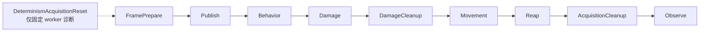

# SpaceBattle 设计说明

本文记录当前 `demo/SpaceBattle` 的可执行设计，而不是上游 latest 文档的理想 API。组件、系统和测试都以本地 Typhon 源码为准；任务 worktree 不带仓库根 `docs/adr/` 副本，ADR 位于主仓库 `C:/Users/zyhs/source/repos/Typhon/docs/adr/`，可从该本地目录的 `file:///` 链接访问。用户运行方式和稳定输出见 [README.md](README.md)。

## 1. 目标、配置与边界

SpaceBattle 的目标是以一个固定 tick、并行 ECS 模拟展示：

1. 50,000 个持久 ECS entity 的 bootstrap 与 cluster-native 遍历；
2. 五模式行为状态机和确定性随机航向；
3. 无跨实体组件写的同时战斗结算；
4. Typhon spatial query 与应用内临时窄化结构的混合目标获取；
5. tick fence、数据库 committed-state 读取、稳定 telemetry 和可选 profiler trace。

运行时固定以下关键参数：

| 参数 | 默认值 | 用途 |
| --- | ---: | --- |
| `ShipCount` | 50,000 | 默认规模；显式性能场景也固定为此值。 |
| `Seed` | `0x5350_4143_4542_4154` | bootstrap 坐标和行为随机派生的基准。 |
| 世界 | 1,000 × 1,000 × 400 | `Hull.Bounds` 的三维点状 AABB；Typhon 持久 spatial grid 只按 XY 分区。 |
| `MaximumHealth` | 1,000 | 每艘船初始生命值。 |
| `TickRate` / `FixedDeltaSeconds` | 25 Hz / 0.04 s | 逻辑帧和移动步长；运行时 overload 不把最低频率降到 25 Hz 以下。 |
| `MaximumCompletedTicks` | 22,500 | 默认 tick 上限；battle outcome 可使运行提前结束。 |
| `SpatialCellSize` | 100 | Typhon XY spatial grid cell size。 |
| `WorkerCount` | -1 | -1 使用 runtime 自动拓扑（最多 8）；正数只用于固定拓扑复现诊断。 |
| 锁定/武器射程 | 200 / 100 | 目标获取的 lock range 与造成伤害的 weapon range。 |
| 武器 | 250 damage / 每 15 tick | phase 由稳定 `EntityKey` hash 分散，射程外只计 weapon use，不写 damage。 |
| Wandering / Turning | 50 / 25 tick | 漫游飞行与转向后的规避飞行长度。 |

固定 25 Hz、关闭自适应 fence cost、并保持核心系统 `CanShed(false)` 的理由见 [ADR-0005](file:///C:/Users/zyhs/source/repos/Typhon/docs/adr/0005-fixed-runtime-scheduling.md)。

## 2. ECS 数据模型

### 2.1 Archetype 与组件

唯一 archetype 是 `Ship`，由五个 `StorageMode.SingleVersion` 组件组成：

| 组件 | 主要字段 | 作用 |
| --- | --- | --- |
| `Hull` | 点状 `AABB3F Bounds`，`[SpatialIndex(32f)]` | 位置和 Typhon spatial 索引输入；32 单位 margin。 |
| `Motion` | 当前/目标三维 heading、`Speed`、`RemainingTurnRadians` | Movement 和转向阶段的可变运动状态。 |
| `Vitals` | `uint CurrentHealth` | Damage 写入；0 表示本 tick 已死亡、等待 Reap。 |
| `Targeting` | `long TargetEntityId` | packed raw ID（高位 `EntityKey`，低位 archetype ID），0 表示无锁。 |
| `Behavior` | `Mode`、`Phase`、`TicksRemaining`、`ModeStartedTick` | 五模式状态机和模式内阶段。 |

所有持久改动都在 Typhon transaction/system 访问声明内完成；直接 cluster span 写入后显式标记 dirty，不能把 `WriteSpatial` 当成 `AABB3F` 的可用更新 API。`Hull`、`Motion` 等字段的真实事实来源永远是数据库组件。

### 2.2 EntityKey 派生快照

当前公开 API 不能从 spatial raw `long` 恢复 `EntityId`，也没有公开的 `GetCluster(chunkId)`。每帧 Publish 按 `EntityKey` 把组件重建到 `SpaceBattleSimulationState` 的派生数组：

- `_frames`：本帧后续 Behavior/Damage/Movement 共享的只读逻辑快照；
- `_telemetryFrames`：Observe 统计使用的镜像；
- generation 数组：只接受当前帧 Publish 过的槽，避免 entity destroy/migration 后出现陈旧值；
- `_entityIds`：把快照 `EntityKey` 映射回 Reap 所需的真实 `EntityId`。

Publish 之后派生快照只由阶段内的受控更新方法修改；下一帧 `PrepareTick` 清除 generation 并完整重建。该内存换 API 的决定见 [ADR-0003](file:///C:/Users/zyhs/source/repos/Typhon/docs/adr/0003-derived-entity-key-snapshots.md)。

### 2.3 旁路并发缓冲

不把跨实体写伪装成系统组件写：

- 每个 worker 一条按 `EntityKey` 索引的 `incoming-damage lane`，加一个 touched-key 列表和 generation，按需稀疏清理；
- 每个 worker 一个 pending-reap `EntityId` buffer；Reap 以固定 worker 顺序拷贝后一次 `DestroyBatch`；
- 每个 worker 一个 thread-affine acquisition `Transaction` slot；
- targeting、combat、system/fence 的计数器在 worker 私有槽或受保护 accumulator 中汇总。

这对应 [ADR-0001](file:///C:/Users/zyhs/source/repos/Typhon/docs/adr/0001-pull-damage-and-deferred-destruction.md) 的 pull damage/deferred destruction，避免并行 `EventQueue<T>.Push` 和攻击者直接修改目标生命值。

## 3. 五种行为模式状态机

`BehaviorMode` 是 `Wandering`、`Tracking`、`Approaching`、`Attacking`、`Turning`；每个模式使用 `BehaviorPhase.Ready`、`Aligning`、`Flying` 中的一部分。模式切换把 `ModeStartedTick` 写为下一逻辑帧编号，使随机派生与 worker/chunk 执行顺序无关。

```text
Wandering --(50 tick flight)--> Tracking --(lock)--> Approaching --(<=100)--> Attacking
    ^                              |                    |                         |
    |                              | no candidate       | target invalid           | target invalid
    |                              v                    v                         v
    +------------------------- (retry)             Turning <----------------------+
                                      Turning --(25 tick evasive flight)--> Wandering
```

### Wandering

- `Ready` 首次从 `seed + EntityKey + ModeStartedTick` 派生均匀三维球面方向和 `[0, 200]` 速度；已有 heading 时派生下一目标方向。
- 首次无 heading 直接进入 `Flying`；已有 heading 先进入 `Aligning`。
- `Movement` 每 tick 最多转 `1 rad/s × 0.04 s`，完成后飞行 50 tick；计数归零时下一帧进入 `Tracking`。
- X/Y/Z 越界都采用反射坐标；位置保持在 `[0, worldSize)` 的有限范围内。

### Tracking

- 只负责一次锁定尝试，不直接修改其他实体；Behavior 对本 cluster 的 tracking sources 选择 direct 或 batched targeting。
- 找到最近且在 200 内的存活目标：距离不超过 100 进入 `Attacking`，否则进入 `Approaching`，并把 packed raw ID 写入 `Targeting`。
- 没有候选则清除锁定、保留自己的 heading/speed，下一 tick 继续尝试。
- `Movement` 会在 Tracking 状态使用当前速度移动，因此从漫游飞行结束到锁定期间不会静止。

### Approaching

- 每帧重新验证 target 存活和 lock range；有效时使用武器速度（200）朝目标转向并移动。
- 距离进入 100 内时下一帧模式切换为 `Attacking`。
- 目标死亡、移出 200 lock range 或 raw ID 无效时清锁并进入 `Turning`；失效发生的这一帧仍允许 Movement 用失效前速度完成一次移动。

### Attacking

- 仍然验证目标；有效时以 `EntityKey` 的稳定 phase 每 15 tick 产生一次 weapon use。
- 只在距离不超过 100 时把 250 damage 写入当前攻击者 worker 的 damage lane；攻击者不直接写目标 `Vitals`。
- 射程外 weapon use 保留在 telemetry，目标在 200 lock range 内仍可保持锁定；锁失效则进入 `Turning`。
- 同一 tick 开始时存活的船仍有机会同时发射；Damage 阶段统一 pull 后可以同归于尽。

### Turning

- `Ready` 从当前 heading 的三维 great-circle 派生一个 50°–300° 的目标弧和目标方向，速度设为 0。
- `Aligning` 每 tick 沿同一 great-circle 最多转 0.04 rad，完成后进入 `Flying`。
- `Flying` 使用 100 速度飞行 25 tick；计数结束后下一帧回到 `Wandering.Ready`。

## 4. 系统 DAG 与阶段协议

`SpaceBattleHost.BuildSchedule` 声明一个 `SpaceBattle` track/DAG，阶段顺序固定为：

```text
Publish → Behavior → Damage → Movement → Reap → Observe
```

实际系统和边如下：



- **FramePrepare（Publish phase）**：每个 runtime tick 只准备一次 generation、清理旁路 lane/reap 数组、attach `PointInTimeAccessor`，记录 tick start。
- **Publish**：按 active cluster occupancy mask 读取五个组件，写入派生快照；bootstrap 首个 fence 的零填充异常窗口按 bootstrap 存活事实处理。只读组件，不创建 transaction。
- **Behavior**：按 cluster span 读 frame，写当前遍历实体的 `Motion/Targeting/Behavior`；Tracking 使用 acquisition transaction 和 hybrid query；显式记录 query metrics。
- **Damage**：固定 worker 顺序 pull 每个实体的所有 damage lane，写该实体自己的 `Vitals`，死亡只标记 pending reap。
- **DamageCleanup**：清除本 tick touched damage keys，防止 lane 数组全量清零。
- **Movement**：跳过死亡/pending-reap 实体；对自身 `Hull/Motion` 做转向、反射移动和显式 dirty marking。空间索引维护留给 tick fence。
- **Reap**：所有并行遍历结束后按 worker ID 顺序合并 pending `EntityId`，执行一次销毁 transaction；不会在 Damage/Movement 中 destroy。
- **AcquisitionCleanup（Observe phase）**：最终 tick 或受控边界释放当前 worker 拥有的 acquisition transaction。
- **Observe**：发布 `SimulationTickCompleted`，每 125 zero-based tick 生成稳定 telemetry sample，并更新完成 tick/边界剩余数。
- **runtime tick fence**：系统提交之后由 Typhon runtime 执行；它刷新 SingleVersion dirty slots、spatial/cluster maintenance 和 WAL durability。telemetry 将 `dirty_marking`、`AABB_refresh`、`migrate_fence`、`FenceFinalize` 与应用系统分开记录。

所有核心系统是 Critical、`CanShed(false)`；Publish/Behavior/Damage/Movement 以固定 `workerCount × 2` chunk 分片，Reap/Observe 等串行尾部明确设为单 chunk。active cluster 数每 tick 重新读取，不能缓存旧 cluster 上界。

## 5. 并发不变量

1. **单槽所有权**：一个 chunk 只由一个 worker 处理，worker 只能写当前遍历的实体槽；系统访问声明与 DAG 保证阶段之间的写读顺序。
2. **组件事实与派生快照分离**：组件是持久事实；Publish 后 `_frames`/`_telemetryFrames` 在本 tick 内提供跨实体只读视图，不通过未经声明的 ECS accessor 读写。
3. **无跨实体组件写**：攻击者只写自己 worker 的 damage lane；Damage 的目标船自己写自己的 `Vitals`。没有攻击者直接开目标实体写事务，也没有并行生产者写 `EventQueue`。
4. **固定归并顺序**：Damage 按 worker ID 0..N-1 累加；Reap 按 worker ID 0..N-1 拷贝；最近目标距离相等时取较小 `EntityKey`。这保证固定 worker 拓扑重复运行的 checksum 稳定。
5. **生命周期边界**：0 health 只进入 pending-reap；只有 Reap 在所有 Damage/Movement chunk 完成后 destroy。DamageCleanup 在 Damage 阶段内紧跟各 worker 伤害应用后清除 touched lane（参见 §4 DAG 图），避免旧伤害泄漏到下一个 tick。
6. **空间 dirty 纪律**：通过 cluster span 修改持久 component 的每个受影响槽显式 `MarkClusterSlotDirty`；不设置 `SpatialBarrierOnly`，让 tick fence 全量刷新三维 AABB 的 spatial 状态。
7. **transaction thread affinity**：acquisition transaction 只能在创建它的 worker 线程复用/释放；runtime 停止后 Host 仍做 best-effort `ReleaseAllAcquisitionTransactions`，不能跨线程假装优雅释放。
8. **边界观察**：Observe 在 tick transaction flush 前发布应用侧观察；Host 停止后在仍打开的 engine 上读取 committed state、补回收 zero-health entity，再把最终 committed snapshot 放入 `SimulationCompleted`，避免把旧镜像当最终事实。

相同 seed + 相同固定 worker 数的 deterministic diagnostic 比较 health/target/mode checksum；跨 worker 数比较始终标为 Explicit，不宣称 worker-count-independent determinism。

## 6. 混合目标获取

目标获取的详细决策记录在 [ADR-0006](file:///C:/Users/zyhs/source/repos/Typhon/docs/adr/0006-hybrid-target-acquisition.md)，算法如下：

1. Behavior 收集一个 cluster 中待 Tracking 的 source frame。
2. source 数不超过 4：对每个 source 通过同一个 worker-owned transaction 调用 Typhon `WhereNearby<Hull>(..., 200)`，过滤自己、死亡候选并做精确三维距离。
3. source 数超过 4：计算所有 source 的 union AABB 并向六面扩展 200；对扩展框做一次 Typhon `WhereInAABB` gather。
4. gather 候选只放入本批次临时的 50-unit 三维 bins（`floor(x/50), floor(y/50), floor(z/50)`）；它不是持久世界索引，也不替代 Typhon XY spatial index。
5. 每个 source 扫描覆盖自身 ±200 的 bins，对存活且非自身候选做精确 3D distance；距离超过 200 丢弃；距离相等时使用较小 `EntityKey` tie-break。
6. `TargetingResult` 只保存 target `EntityId` 和距离平方；Behavior 再设置 raw target、模式和武器速度。

由于 Typhon 默认 spatial cell 只分区 XY，Z 方向会扩大候选集；临时 bins 只用于一次 gather 的内存窄化。两条路径均与暴力最近邻参考实现比较，telemetry 必须保留：

- `query_direct`：逐 source radius query 数；
- `query_batched`：gather query 数；
- `gather_candidates`：一次 gather 返回候选数；
- `exact_distance_tests`：真正做 3D 距离计算的候选数。

## 7. per-worker acquisition transaction

当前 Typhon 没有公开轻量 epoch scope，而 cluster spatial query 需要 epoch；`EpochGuard` 是 internal。因此 demo 按 [ADR-0007](file:///C:/Users/zyhs/source/repos/Typhon/docs/adr/0007-per-worker-acquisition-transactions.md) 使用 `Transaction`：

- worker 第一次进入 Behavior 时按需创建一个 read-only transaction；
- 同一逻辑帧的多个 Behavior chunk 复用同一 slot，避免每 chunk 并发创建 transaction 的锁争用；
- transaction 是 thread-affine，只由创建它的 worker 使用；
- slot 允许跨一个 tick fence 延用：创建 tick `t` 可在下一帧继续使用，worker 再下一次进入 Behavior 时释放并替换；这会让页面回收最多延后一帧，是刻意的 workaround；
- `AcquisitionCleanup` 在最终 tick 释放本线程 slot，Host 停止后 `ReleaseAllAcquisitionTransactions` 做受控清理；fatal 路径不宣称完整优雅回收；
- 固定 worker 的 determinism diagnostic 在每 tick 的 `DeterminismAcquisitionReset` 先释放 slot，排除 transaction 跨 tick 快照对复现的干扰。

Publish、Damage、Movement 不创建 acquisition transaction。

## 8. 持久化、telemetry 与生命周期

### 持久化

bootstrap 用 `Immediate` transaction 批量 spawn/write 五列，然后 `WriteTickFence(0)`；运行中组件都是 SingleVersion，写入先可见，runtime tick fence 才把 dirty slots 批量写 WAL。正常结束时 Host 停止 runtime、补回收 zero-health entity，并在仍打开的 engine 上用 read-only transaction 读取 committed values，再发布最终快照。`ForceCheckpoint` 测试验证 checkpoint 前后组件一致。

每次运行是 fresh run：`SpaceBattlePaths.ReplaceDatabaseDirectory` 只替换自己的 `space-battle.typhon`，不实现 pause/resume。ADR-0008 记录的 FenceWal 恢复缺口（#569）意味着不能把“最多丢一个 tick”当作本 demo 的崩溃后继续战斗保证。

### Telemetry 与 trace

应用侧 `TickTiming` 收集 tick duration，并计算 p50/p95/p99/max；`>40 ms` 计数严格不包含 40 ms。`SpaceBattleTelemetrySampling` 在 zero-based tick 0 和每 125 tick 采样，字段使用 invariant-culture。系统 accumulator 分解应用阶段和 fence 阶段；`StragglerGapUs` 不输出，因为当前是占位值 0。

Profiler `.typhon-trace` 是可选、默认关闭的独立 typed-event 管线，路径由 `typhon.telemetry.json` 或 `TYPHON__PROFILER__TRACE` 解析。README 给出创建父目录、启动和清理环境变量的命令。trace 产生后保留到用户手动归档/删除；正常 shutdown 才能完整 drain/flush，fatal stop 只能 best effort。性能场景必须保持 trace off。

### graceful shutdown 与 fatal

Ctrl+C 只设置 cancellation；Host 记录请求时的 completed/runtime tick，等待 in-flight tick 到边界，再 `Shutdown()`，避免多跑后续 tick。若同时观测到系统异常，优先 `FatalStop()` 并返回 `fatal`。

`AbortTickAndStop` 不是全局事务回滚：异常之前已 commit 的系统写入不会被自动撤销，已开始的并行 worker 可能完成，fence 也可能执行；Host 记录 `FailedSystemName`、异常和 `TickOutcome`，不重试、不继续，并以非零状态退出。graceful shutdown/Profiler 完整 flush 的语义不能套用到 fatal 路径。

## 9. 限制、workaround 与尚未修复问题

[ADR-0008](file:///C:/Users/zyhs/source/repos/Typhon/docs/adr/0008-accepted-typhon-limitations.md) 是完整清单；这里把责任边界显式分开：

| 类别 | 当前事实 | SpaceBattle 的处理 | 是否宣称引擎已修复 |
| --- | --- | --- | --- |
| Typhon 限制 | Spatial grid 只分区 XY；`WriteSpatial` 不接收 `AABB3F`。 | `Hull` 通过 cluster span 写入，依赖 fence 全量刷新；targeting 做精确 Z 距离和临时 3D bins。 | 否；这是 demo workaround。 |
| Typhon 限制 | 没有公开 epoch scope / `EntityId.FromRaw` / `GetCluster`。 | per-worker read transaction + EntityKey 派生快照。 | 否。 |
| Typhon 限制 | 并发创建 transaction 有锁争用；`EventQueue<T>.Push` 不适合作为并行 producer；parallel fence finalize 有串行锁。 | 每 worker 复用 transaction；private damage/reap arrays；telemetry 单独显示 dirty/fence 成本。 | 否；观察而不是根修。 |
| 未修复缺口 | FenceWal 恢复承诺存在 #569 缺口；空间迁移 hysteresis 可能造成小半径边界遗漏。 | fresh run，不宣称崩溃续跑；保留移动空间查询回归测试，锁定半径 200 大于默认迟滞带。 | 否。 |
| 未修复/未宣称 | 跨 worker 数的结果不保证相同；部分 runtime telemetry（如 StragglerGapUs）尚未有有效值；latest 文档与本地源码可能不一致。 | 固定 worker 只做 Explicit diagnostic；不输出占位 gap；以本地测试/API 为规格。 | 否。 |
| 语义限制 | `AbortTickAndStop` 不是整个 tick 原子回滚；graceful shutdown 可能遇到 in-flight tick。 | 记录完整 fatal 错误、停止并以非零退出；取消等待当前边界；不重试/伪装完整收尾。 | 否；这是当前 runtime 合约边界。 |

因此，临时 bins、派生快照、dirty marking、private lanes/reap buffers、per-worker transaction slot 和固定 worker diagnostic 都是 demo 内的补偿设计；它们不应被移到 `src/` 作为“引擎修复”。如果未来 Typhon 公开 epoch、支持三维 spatial write 或修复恢复缺口，先更新回归测试和 ADR，再删除对应 workaround。

## 10. 性能场景协议

`SpaceBattle.Tests/PerformanceTests.cs` 的唯一显式性能场景：

- `[Explicit]`、`[Category("Performance")]`，并标记 `Manual`；Debug 构建直接跳过，必须 Release 手工运行；
- 配置为 50,000 ship、25 Hz、500 tick；停止边界可能让一个 in-flight tick 完成，因此实际 `completed_ticks` 可为 500/501，但 zero-based 0–124 始终是前 125 tick warmup，测量窗口固定为 125–499 的 375 tick；
- `SimulationTickCompleted.Duration` 计算墙钟 p50/p95/p99/max 和 `>40 ms` 次数；warmup 不进入这组统计，且不对 p95 做 assertion。
- 输出 bootstrap、termination/remaining、稳定 telemetry 和最新 sample 的系统/fence 分解。系统 accumulator 是截至该 sample 的累积窗口（包含 warmup），所以只把它作为实测成本分解，不把它误称为 warmup-trimmed phase 百分位；runtime 没有有效样本的 fence 条目输出 0 并标注 `unexposed_zero_not_cost`。p95 >40 ms 只输出 warning，不是跨机器 CI 硬门槛；
- trace 保持关闭，报告应附机器 CPU、worker 拓扑、构建配置、磁盘和 profiler 开关，不能把某一次机器测量写成通用 SLA。

该场景与默认测试分离，默认命令只运行 SpaceBattle 相关项目并自动跳过 Explicit 性能测试。
